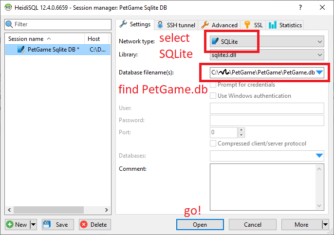
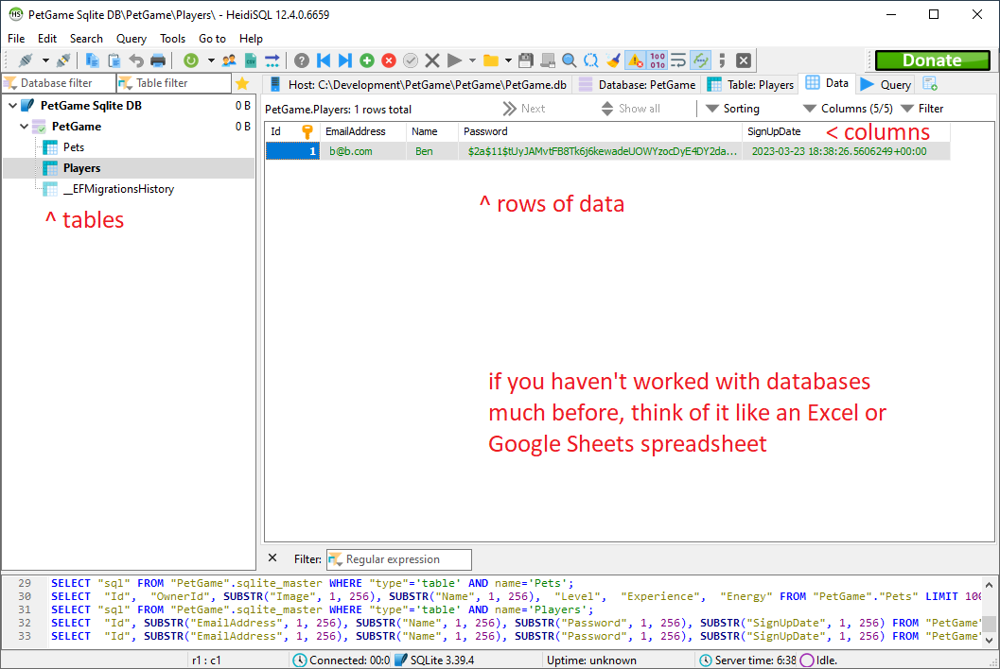

# PetGame

## What is it?

PetGame is a skeleton project for making your own pet game! (Or any browser-based game, really.)

It's written using Blazor Server, a framework for making web apps in C#, without JavaScript.

[](https://ko-fi.com/A0A12KQ16)

## Installing & Running

1. Install .NET SDK 7.04, or later
   * https://dotnet.microsoft.com/en-us/download/dotnet/7.0
   * Download the "x64" version of the SDK; Windows and Mac downloads are available
2. Download PetGame!
   * Download a ZIP using the green "Code" button, above; unzip it wherever you like.
3. Run the game!
   1. Open the `PetGame/PetGame` folder, and open a terminal/PowerShell window there (in Windows, hold Shift and right-click on some empty space in the folder, and select "Open PowerShell window here")
      
   2. Type `dotnet run`, and press enter!
4. In your browser, visit http://localhost:5083

If all went well, you should see a simple page with Login and Sign Up buttons!

If the instructions aren't quite clicking for you, I've created a 12 minute video that walks through the process of getting PetGame up and running:

* [Make a Browser Pet Game in C# ...](https://www.youtube.com/watch?v=jPzAvcCX2tk)

## Developing

### Libraries Used

PetGame leverages several open-source libraries to do some of its work. If you're familiar with C#, but not these libraries, you may want to take a moment to learn about some of them now (search Google, ask ChatGPT, or find tutorials on YouTube). If you're new to C#, it might be a bit much to dive into these; take some time learning the PetGame code, itself, first.

* [Entity Framework](https://learn.microsoft.com/en-us/aspnet/entity-framework), for storing data in a database
* [Blazored.Modal](https://blazored.github.io/Modal/), for displaying modals
* [FluentValidation](https://docs.fluentvalidation.net/) and [Blazored.FluentValidation](https://github.com/Blazored/FluentValidation), for validating user input

I've created a 40 minute that takes you through a tour of parts of the code, and some useful programming tools; at the end of the video, you'll have created a way to recruit more pets in PetGame:

* [Keep Making a Browser Pet Game in C# ...](https://www.youtube.com/watch?v=rqTaw6BKRLM)

### Common Tasks

#### Programming!

You're going to need an IDE - an "Integrated Development Environment" (but no one ever actually calls it that). An IDE is text editor desigend to make programming easier. IDEs do simple things, like color the text in meaningful ways, cleverer things, like auto-complete bits of code for you, and advanced things, like let you pause your program at any point to see exactly what it's doing, measure the code's performance, and more.


You REALLY don't want to just use Notepad, or even Notepad++. There are a lot of IDEs out there, many with free options.

Here are the most-popular ones for C# (the language PetGame is written in):
* [Visual Studio](https://visualstudio.microsoft.com/downloads/)
  * By the makers of C#, itself; always up to date with the latest additions to the C# language
  * Free version available
* [Rider](https://www.jetbrains.com/rider/) (seen in screenshot, above)
  * Offers more features than Visual Studio, and is less buggy
  * Must pay to continue using it after 30 days
* [vscode](https://code.visualstudio.com/)
  * General-purpose IDE; lacks some features available in Visual Studio and Rider
  * Lower system requirements (Visual Studio and Rider can get slow)
  * Free

#### Adding Pages

1. Using your IDE, right-click `PetGame/PetGame/Pages`, and create a new Razor Page
   * As the game grows, you may want to create folders within `PetGame/PetGame/Pages` to help organize things!
1. If the page should only be accessible to logged-in players, add `@attribute [Authorize]` to the top of the file.
1. Look at an existing page to get an idea for how to make your own. `MyHouse.razor` is a good one to start with.

#### Looking at or Modifying the Contents of the Database, Directly

You should download a database client for viewing databases.

When getting started with PetGame, which uses Sqlite, [HeidiSQL](https://www.heidisql.com/download.php) client is a good, free/open-source database client that can view Sqlite databases, as well as many other SQL-ish databases.

* HeidiSQL download: https://www.heidisql.com/download.php

The PetGame database is stored in a file called `PetGame.db`, which will appear in the `PetGame/PetGame` directory the first time you run the game. You can open this file with HeidiSQL to view the database, and edit its contents.



#### Adding a New Table to the Database

It's not strictly necessary, but if you don't already have a tool for viewing databases, download and install [HeidiSQL](https://www.heidisql.com/download.php), and refer to the instructions above for how to connect to your PetGame database.



While its possible to create tables using this tool, you shouldn't do so! PetGame is using Entity Framework to do "code-first database" design. Instead of creating or modifying tables by hand, you'll create them in code, and let Entity Framework create the table for you.

1. In your IDE, open `PetGame/Database/Tables`, and look at one of the tables.

2. Let's make a new "InventoryItem" table to store items a player owns! Right-click on the "Tables" folder, and Add a new Class. Call it "InventoryItem".

3. Edit the class to look like the following:
   ```c#
   namespace PetGame.Database.Tables;
   
   public sealed class InventoryItem: PetGameTable
   {
       public required long OwnerId { get; set; }
       public Player? Owner { get; set; }
   
       public required string Image { get; set; }
       public required string Name { get; set; }
       public int FoodEnergy { get; set; }
       public int SellValue { get; set; }
   }
   ```

   * `long OwnerId` will be used to store the id of the player who owns the item.
   * `Player? Owner` is optional: it won't actually appear in the database, but Entity Framework will use it to give you handy access to the owning player in code.
   * `string Image` will hold the filename of the graphic for the item
     * You might want to create an item image or two, and put them in `PetGame/wwwroot/images/items`
   * `string Name` will hold the name of the item shown to players
   * `int FoodEnergy` is how much Energy a pet should gain if fed the item (items with 0 FoodEnergy aren't edible)
   * `int SellValue` is how much money a player should gain if selling the item

4. One more code change to go! Open `PetGame/Database/PetGameDatabase.cs`. Near the top, there's a list of tables. This is the master list of tables in your database. Add a new line after the Pets and Players line:
   ```c#
   public DbSet<InventoryItem> InventoryItems => Set<InventoryItem>();
   ```

5. Now that your code knows about this new table, you just have to instruct Entity Framework to hook it all up! Open a terminal/PowerShell window in the `PetGame/PetGame` directory, and run:
   ```powershell
   dotnet ef migrations add CreateInventoryItemsTable
   ```

   * The last bit - `CreateInventoryItemsTable` - can be anything you want; it's the name you're giving to this change. (Most "special characters" aren't allowed; keep it to letters and numbers just to be safe.)

6. Finally, run the game! After it starts up, press "F5" in HeidiSQL, and you'll see the new table has appeared!

You can use HeidiSQL to cheat some items to your account.

1. Click the "InventoryItems" table
2. Click the "Data" tab near the top of the window
3. Right-click somewhere in the empty area on the right, and select "Insert row"
4. Fill in the details (for OwnerId, if you created an account, you're probably user 1, so enter 1!)

You'll probably want to be able to see these items along with your pets. I'm going to leave that to you to figure out, but if you see how `PetGame/Pages/MyHouse.razor` loads and displays your pets, you should be able to use that as a basis for loading and displaying inventory items, too!

#### Adding (or Removing) Columns from an Existing Table

If you created a new `InventoryItem` table using the instructions above, you may recall we added a `SellValue` to the items... but the game doesn't even allow players to have money, yet!

1. Open `PetGame/Database/Tables/Player.cs`

2. Add a new line below the `SignUpDate` as follows:
   ```c#
   public int Money { get; set; }
   ```

   * If you'd like new players to start with some moneys, add the starting value at the end of the line; for example:
     ```c#
     public int Money { get; set; } = 10; // players start with 10 money
     ```

3. Open a terminal/PowerShell window in the `PetGame/PetGame` directory, and run:

   ```powershell
   dotnet ef migrations add AddMoneyToPlayers
   ```

   * Again, you can replace `AddMoneyToPlayers` with whatever you want; its a name used to describe the changes.

4. Finally, run the game! After it starts up, check out the Player table in HeidiSQL; a Money column will have appeared.

   * Note that if you chose a default value for Moneys, existing players won't get it! There are ways to fix that; Google or ask ChatGPT about "custom SQL in Entity Framework migrations".

How to display a player's Moneys, or alter it, I'll leave to you. One place to start might be making one of the pet "Explore" actions grant money to the player. If you're feeling ready for a bigger challenge, you could try making a new `GroceryStore.razor` page for players to buy items from!

### Deploying Your Game!

**TODO:** I'll add instructions on deploying your game to the internet later. In the meanwhile, Google around for how to deploy a "hosted Blazor WASM" web app; there's info out there!
