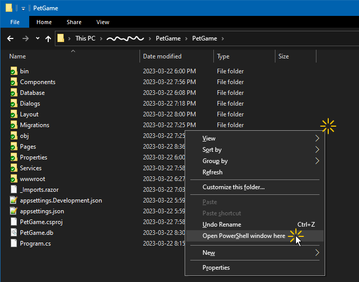
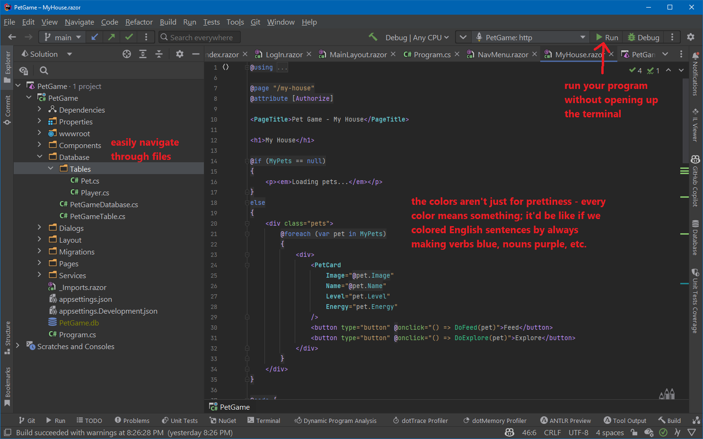

# PetGame

## What is it?

PetGame is a skeleton project for making your own pet game! (Or any browser-based game, really.)

It's written using Blazor Server, a framework for making web apps in C#, without JavaScript.

## Installing & Running

1. Install .NET SDK 7.04, or later
   * https://dotnet.microsoft.com/en-us/download/dotnet/7.0
   * Download the "x64" version of the SDK; Windows and Mac downloads are available
2. Download PetGame!
   * Download a ZIP using the green "Code" button, above; unzip it wherever you like.
3. Run the game!
   1. Open the `PetGame/PetGame` folder, and open a terminal/powershell windows there (in Windows, hold Shift and right-click on some empty space in the folder, and select "Open Powershell Window Here")
      
   2. Type `dotnet run`, and press enter!
4. In your browser, visit http://localhost:5083

If all went well, you should see a simple page with Login and Sign up buttons!

## Developing

### Libraries Used

PetGame leverages several open-source libraries to do some of its work. If you're familiar with C#, but not these libraries, you may want to take a moment to learn about some of them now (search Google, ask ChatGPT, or find tutorials on YouTube). If you're new to C#, it might be a bit much to dive into these; take some time learning the PetGame code, itself, first.

* [Entity Framework](https://learn.microsoft.com/en-us/aspnet/entity-framework), for storing data in a database
* [Blazored.Modal](https://blazored.github.io/Modal/), for displaying modals
* [FluentValidation](https://docs.fluentvalidation.net/) and [Blazored.FluentValidation](https://github.com/Blazored/FluentValidation), for validating user input

### Common Tasks

#### Programming!

You're going to need an IDE - an "Integrated Development Environment" (but no one ever actually calls it that). An IDE is text editor desigend to make programming easier. IDEs do simple things, like color the text in meaningful ways, cleverer things, like auto-complete bits of code for you, and advanced things, like let you pause your program at any point to see exactly what it's doing, measure the code's performance, and more.

You REALLY don't want to just use Notepad, or even Notepad++. There are a lot of IDEs out there, many with free options.

Here are the most-popular ones for C# (the language PetGame is written in):
* [Visual Studio](https://visualstudio.microsoft.com/downloads/)
  * By the makers of C#, itself; always up to date with the latest additions to the C# language
  * Free version available
* [Rider](https://www.jetbrains.com/rider/) (seen in screenshot, above)
  * Offers more features than Visual Studio, and is less buggy
  * Must pay to continue using it after 30 days
* [vscode](https://code.visualstudio.com/)
  * General-purpose IDE; lacks some features available in Visual Studio and Rider
  * Lower system requirements (Visual Studio and Rider can get slow)
  * Free

#### Adding Pages

1. Using your IDE, right-click `PetGame/PetGame/Pages`, and create a new Razor Page
   * As the game grows, you may want to create folders within `PetGame/PetGame/Pages` to help organize things!
1. If the page should only be accessible to logged-in players, add `@attribute [Authorize]` to the top of the file.
1. Look at an existing page to get an idea for how to make your own. `MyHouse.razor` is a good one to start with.

#### Looking at or Modifying the Contents of the Database, Directly

You should download a database client for viewing databases.

When getting started with PetGame, which uses Sqlite, [HeidiSQL](https://www.heidisql.com/download.php) client is a good, free/open-source database client that can view Sqlite databases, as well as many other SQL-ish databases.

* HeidiSQL download: https://www.heidisql.com/download.php

The PetGame database is stored in a file called `PetGame.db`, which will appear in the `PetGame/PetGame` directory the first time you run the game. You can open this file with HeidiSQL to view the database, and edit its contents.

#### Adding a New Table to the Database

**TODO:** I'll add more instructions on this later.

## Deploying Your Game!

**TODO:** I'll add instructions on deploying your game to the internet later. In the meanwhile, Google around for how to deploy a "hosted Blazor WASM" web app; there's info out there!
